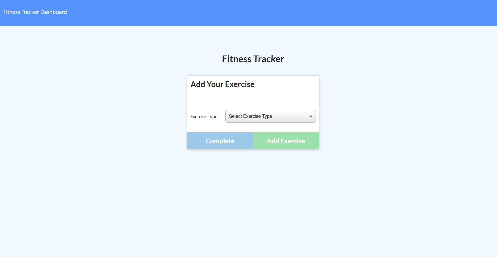
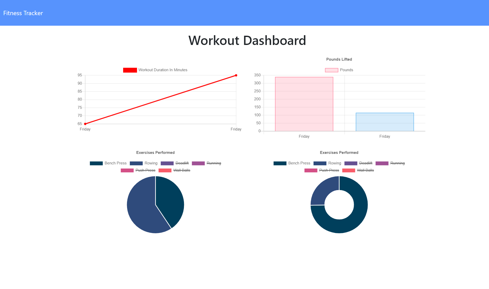

# Fitness Tracker

[LIVE SITE -- Fitness Tracker](https://protected-shore-78478.herokuapp.com/)

## Table of Contents
- [Description](#description)
- [Screenshots](#screenshots)
- [Installation](#installation)
- [Usage](#usage)
- [Contributors](#contributors)
- [Testing](#testing)
- [Questions](#questions)
- [License](#license)

---

## Description
This is a site for a person to track their workouts. It allows a user to input their resistence-based and cardio-based exercises and aggregate the duration of a workout, number of exercises performed, distance covered, weight lifted, and number of sets and reps performed. All of the information is compiled into charts and graphs as part of the Workout Dashboard. This application uses JavaScript, HTML, CSS, MongoDB and Mongoose for database functionality, and deployed on Heroku.

---

## Screenshots

---

## Installation
As this program uses Mongoose, Express, and Morgan dependencies, you will want to open an integrated terminal in the project folder to make sure those are installed. When cloning the respository, the package.json should already list the dependencies needed. First, you'll need to make sure the dependancies are installed on your maching by typing "npm i" into the terminal. Then, install the node modules by typing "npm i" into the terminal. If those dependancies are not listed in the package.json file, you can add them by typing "npm i express" and "npm i mongoose" into the integrated terminal.   

---

## Usage
This is a simple fitness tracker where people can enter and monitor their workout progress over a week. For handling inputs, the site is conntect to a MongoDB Atlas to store and manage data. 

---

## Contributors
This project code was largely provided and was improved upon by Adam Horn, with guidance from Ryan Skog and Zac Warner.

---

## Testing
Testing files are not provided but can be done when forking and cloning the repository to your computer.  

---

## Questions
GitHub username: [mradamhorn](https://github.com/mradamhorn)

Email address: mr.amhorn@gmail.com

---

## License
